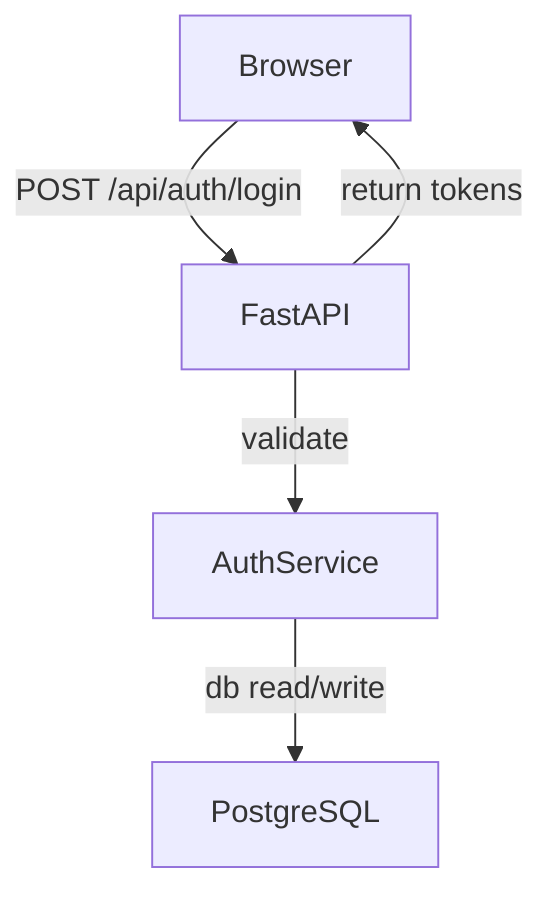
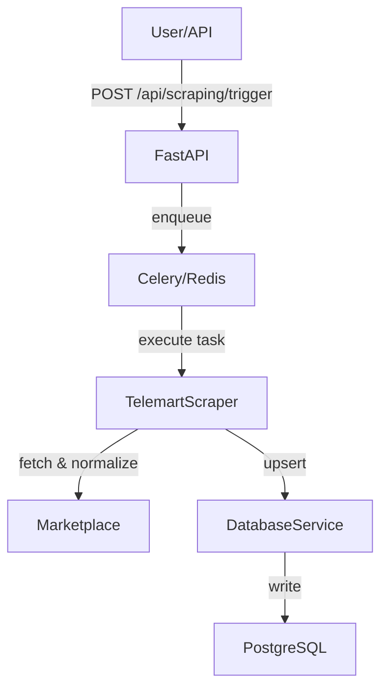
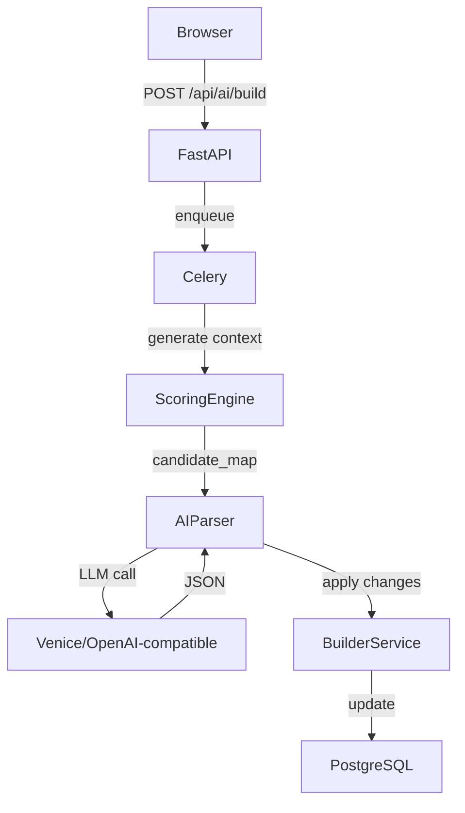
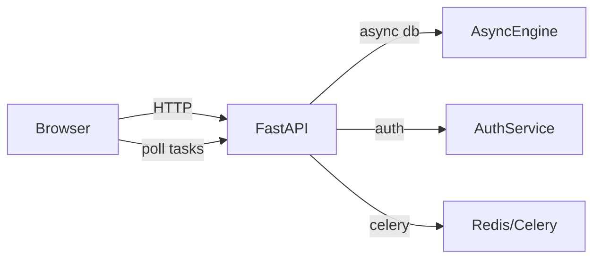

# Project Architecture Overview

This document is a comprehensive, code-driven architecture overview of the PC Builder project. It is written from the repository sources and aims to serve as the structural foundation for a diploma thesis. All statements reference actual files from the codebase.

**Contents**
- **Project Overview**
- **Technology Stack**
- **Full Project Structure**
- **Backend Architecture**
- **Database Architecture**
- **Scraping System**
- **AI System Architecture**
- **Rule-Based Engine**
- **Frontend Architecture**
- **Authentication System**
- **Docker & Infrastructure**
- **Request & Data Flow Diagrams**
- **Design Decisions**
- **System Advantages**
- **Conclusion**

---

**Project Overview**

Purpose
- The application assembles, recommends and persists PC builds using a hybrid rule-based + AI approach. The backend exposes REST endpoints for build management, product search, scraping triggers and AI features; the frontend is a React + TypeScript SPA that consumes these endpoints.

Main goals
- Provide a guided, compatible PC configurator (builder) with AI-assisted recommendations and chat-driven followup.
- Keep an up-to-date product catalog by scraping marketplace(s) and normalizing product/spec data.
- Combine deterministic scoring and compatibility checks with an LLM-based decision layer that chooses from pre-filtered candidates.

Main functionality (high level)
- Product ingestion via scrapers (see [backend/app/tasks/telemart_scraper.py](backend/app/tasks/telemart_scraper.py#L1-L40)).
- Upserts to canonical product + spec tables ([backend/app/services/database_service.py](backend/app/services/database_service.py#L1-L40)).
- Builder CRUD (create builds, add/replace components, validate compatibility) ([backend/app/api/builder.py](backend/app/api/builder.py#L1-L40), [backend/app/services/builder_service.py](backend/app/services/builder_service.py#L1-L40)).
- Rule-based ranking and compatibility scoring ([backend/app/utils/scoring_engine.py](backend/app/utils/scoring_engine.py#L1-L40)).
- AI orchestration (prepare context from rule-based results, call LLM, apply changes) ([backend/app/tasks/ai_tasks.py](backend/app/tasks/ai_tasks.py#L1-L60), [backend/app/utils/parse_utils.py](backend/app/utils/parse_utils.py#L1-L60)).

Hybrid architecture
- The system uses a deterministic rule-based engine to pre-filter and score candidates (fast, debuggable), then hands top candidates and explicit compatibility constraints to an LLM. The LLM selects/coalesces the final build while being constrained to provided candidates via prompts and input format.

Why modern
- ASGI web server (FastAPI) with async DB sessions for endpoint responsiveness.
- Separate sync engine retained for Celery/legacy tasks (SQLAlchemy sync engine + async engine co-exist) ([backend/app/database.py](backend/app/database.py#L1-L80)).
- Background processing via Celery + Redis broker, enabling asynchronous AI and scraping workloads ([backend/app/celery_app.py](backend/app/celery_app.py#L1-L40)).
- Clear separation: API routers, services, models, utilities, tasks and schemas.

---

**Technology Stack**

Backend
- FastAPI — async-first web framework. Used for lightweight REST endpoints, dependency injection, and lifecycle management. See app entrypoint: [backend/app/main.py](backend/app/main.py#L1-L40).
- SQLAlchemy (ORM) — models defined in [backend/app/models/](backend/app/models/). Provides sync and async engines to support both FastAPI (async) and Celery tasks (sync).
- Celery — task queue for asynchronous scraping and AI tasks ([backend/app/celery_app.py](backend/app/celery_app.py#L1-L40)).
- Redis — used as Celery broker and cache (configured via env vars / seen in celery config). Redis is referenced as the default CELERY_BROKER_URL.

Why & interactions
- FastAPI handles incoming HTTP requests, uses async SQLAlchemy sessions via `get_async_db` to talk to the DB ([backend/app/database.py](backend/app/database.py#L1-L80)).
- Celery tasks use the synchronous DB session via `SessionLocal`/`AsyncSessionLocal` for persistence inside tasks ([backend/app/tasks/*], [backend/app/database.py](backend/app/database.py#L1-L80)).

Frontend
- React + TypeScript (Vite) — SPA delivering the builder UI, AI chat, product pages, and admin scraping trigger UI ([frontend/src](frontend/src)).
- Axios for API communication and JWT injection ([frontend/src/lib/apiClient.ts](frontend/src/lib/apiClient.ts#L1-L40)).
- Hooks: `useAIBuild`, `useAIChat` encapsulate polling and task lifecycle ([frontend/src/hooks](frontend/src/hooks)).

Database
- PostgreSQL — relational store with normalized tables for generic `products` and per-category spec tables (CPUs, GPUs, RAM, storage, PSU, cooling). See models in [backend/app/models/](backend/app/models).

AI Integration
- Venice/Groq/OpenAI-compatible client via `openai` package (the code uses `OpenAI` from `openai`) and points to a base_url (configured) to call model-based chat completions ([backend/app/utils/parse_utils.py](backend/app/utils/parse_utils.py#L1-L80)).
- Domain-specific system prompts & strict instructions live in [backend/app/utils/prompts.py](backend/app/utils/prompts.py#L1-L200).

Background Processing
- Celery + Redis — tasks for scraping and AI processing are defined under [backend/app/tasks/](backend/app/tasks), invoked from API routes and polled by frontend.

DevOps / Infrastructure
- Dockerfiles exist for backend and frontend ([backend/Dockerfile](backend/Dockerfile), [frontend/Dockerfile](frontend/Dockerfile)). A top-level `docker-compose.yml` is present to wire PostgreSQL, Redis, backend, frontend, and workers together.

---

**Full Project Structure**

Repository (abridged) — top-level folders and important files (expanded from the workspace):

backend/
 - Dockerfile
 - requirements.txt
 - app/
   - main.py  (FastAPI app entrypoint)
   - database.py  (sync + async engines, dependencies)
   - init_db.py  (migration runner + admin init)
   - celery_app.py  (Celery configuration)
   - logging_config.py
   - security_config.py
   - schemas.py, auth_schemas.py, builder_schemas.py, scraping_schemas.py
   - api/
     - auth.py
     - builder.py
     - chat.py
     - product.py
     - scraping.py
   - models/
     - base.py
     - product.py
     - cpu.py
     - gpu.py
     - motherboard.py
     - ram.py
     - storage.py
     - psu.py
     - cooling.py
     - build.py
     - user.py
     - chats.py
   - services/
     - auth_service.py
     - builder_service.py
     - database_service.py
     - brute_force_protection.py
   - tasks/
     - ai_tasks.py
     - scraping_tasks.py
     - telemart_scraper.py
     - scraping_utils.py
   - utils/
     - scoring_engine.py
     - feature_extractor.py
     - mapper.py
     - mappings.py
     - parse_utils.py
     - prompts.py
     - rate_limit.py

frontend/
 - Dockerfile
 - package.json
 - src/
   - main.tsx
   - App.tsx
   - routes/AppRouter.tsx
   - lib/apiClient.ts
   - lib/auth.ts
   - hooks/useAIBuild.ts, useAIChat.ts
   - pages/BuilderPage.tsx, AIChatPage.tsx, DashboardPage.tsx, ProductPage.tsx, ProductsPage.tsx
   - components/ (ComponentSelector, BuildSummaryPanel, AI chat components, Product modal, etc.)

For each important folder:
- `app/models/`: canonical DB mapping. Each spec (CPU, GPU, RAM, ...) lives in a dedicated table and is linked 1:1 to `products` via `product_id` (see [backend/app/models/product.py](backend/app/models/product.py#L1-L60)). This enables normalized storage of category-specific structured data.
- `app/services/`: business logic that orchestrates DB reads/writes, validation and operations used by routers. `BuilderService` and `DatabaseService` are the core examples.
- `app/tasks/`: long-running operations executed via Celery — scrapers for remote marketplaces and AI tasks that call LLMs and apply build changes.
- `app/utils/`: helpers, the scoring engine and mapping/normalization logic used both by scrapers and the builder.
- `frontend/src/`: UI primitives, hooks, and pages. `useAIBuild` / `useAIChat` encapsulate API interactions and polling for Celery task results.

---

**Backend Architecture (Layered)**

Layering and responsibilities
- API layer (routers in `app/api/*`) — handle HTTP, input validation (Pydantic), authentication dependencies and route composition. Examples: [backend/app/api/builder.py](backend/app/api/builder.py#L1-L40), [backend/app/api/chat.py](backend/app/api/chat.py#L1-L40).
- Service layer (`app/services/*`) — core business logic: `BuilderService` (build lifecycle), `DatabaseService` (upserts, queries), `AuthService` (JWT management) and `brute_force_protection`.
- Repository / Data layer (`app/models/*`) — SQLAlchemy mapped models and DB configuration in `database.py`.
- Async/background layer (`app/tasks/*`) — Celery tasks that use synchronous or asynchronous DB sessions depending on the workload.

Dependency injection and lifecycle
- FastAPI dependencies use `get_async_db` for endpoints, returning an async session with commit/rollback built-in ([backend/app/database.py](backend/app/database.py#L1-L80)).
- The application lifespan (startup/shutdown) calls `init_database()` (synchronous helper) to create tables and run migrations ([backend/app/main.py](backend/app/main.py#L1-L40) and [backend/app/init_db.py](backend/app/init_db.py#L1-L80)).

Request lifecycle (example: request to builder recommendations)
1. HTTP request -> FastAPI router `app/api/builder.py` ([backend/app/api/builder.py](backend/app/api/builder.py#L1-L40)).
2. Auth dependency `get_current_active_user` enforces JWT authentication ([backend/app/services/auth_service.py](backend/app/services/auth_service.py#L1-L40)).
3. `get_async_db` yields `AsyncSession`.
4. Router calls `BuilderService` to load build context (joinedloads used extensively to include product specs) ([backend/app/services/builder_service.py](backend/app/services/builder_service.py#L1-L40)).
5. Router prepares a candidate list and calls `rank_category_products` from `scoring_engine` to produce pre-filtered, scored candidates.
6. Router responds with recommendations to frontend.

Middleware, logging and security hooks
- Minimal middleware used (CORS is configured in [backend/app/main.py](backend/app/main.py#L1-L40)).
- Logging configured via structlog in [backend/app/logging_config.py](backend/app/logging_config.py#L1-L80).

---

**Database Architecture**

Overview
- Canonical `products` table contains marketplace-agnostic fields (name, price, images, brand, category). Category-specific structured fields are stored in dedicated spec tables: `cpus`, `gpus`, `motherboards`, `rams`, `storage_specs`, `psus`, `cooling_specs`. See the model definitions in [backend/app/models/](backend/app/models).

Key models
- Product
  - Purpose: canonical product record, central join point for all spec tables. See [backend/app/models/product.py](backend/app/models/product.py#L1-L80).
  - Important fields: `id`, `external_id` (marketplace id), `name`, `price`, `category` (enum), `other_features` (JSON), `brand`.
  - Relationships: one-to-one to each spec table via relationship attributes (cpu_spec, gpu_spec, etc.).

- CPU
  - Purpose: CPU-specific fields for socket, cores, clocks, TDP, memory support and `performance_score` used by scoring engine. ([backend/app/models/cpu.py](backend/app/models/cpu.py#L1-L80)).
  - Key fields: `socket`, `cores`, `threads`, `base_clock`, `boost_clock`, `tdp`, `memory_support`, `l3_cache`, `performance_score`, `graphics_model`.

- GPU
  - Purpose: GPU-specific performance attributes, VRAM, recommended PSU. ([backend/app/models/gpu.py](backend/app/models/gpu.py#L1-L60)).

- Motherboard
  - Purpose: socket/chipset/ram_type/form_factor/slots — used in compatibility checks. ([backend/app/models/motherboard.py](backend/app/models/motherboard.py#L1-L60)).

- RAM
  - Purpose: kit capacity, modules count, frequency, CAS latency and timings used for RAM compatibility and scoring. ([backend/app/models/ram.py](backend/app/models/ram.py#L1-L60)).

- StorageSpec
  - Purpose: SSD/HDD capacity, interface, read/write speeds and RPM for storage ranking and selection. ([backend/app/models/storage.py](backend/app/models/storage.py#L1-L60)).

- PSU and Cooling
  - PSU: wattage, certification, modularity that feed compatibility and power budget logic. ([backend/app/models/psu.py](backend/app/models/psu.py#L1-L60)).
  - Cooling: TDP support, socket lists used to verify cooler compatibility. ([backend/app/models/cooling.py](backend/app/models/cooling.py#L1-L80)).

Normalization & upsert logic
- Scrapers map marketplace-specific feature names into normalized spec fields using `mappings.py` and `mapper.py` and coerce types using `scraping_tasks._coerce_for_model` and `_filter_columns`. Upsert is implemented with a PostgreSQL `ON CONFLICT` flow in `DatabaseService.upsert_product_with_spec` ([backend/app/services/database_service.py](backend/app/services/database_service.py#L1-L120)). This preserves canonical product rows while selectively updating non-empty fields on conflict.

Compatibility & design rationale
- Why separate spec tables: normalizes domain data, avoids sparse columns in a single table and keeps typed fields grouped — which improves query clarity and allows joinedload-based eager loading for performance and clear mapping to domain logic.

---

**Scraping System**

Architecture
- Scraping is implemented as an asynchronous marketplace scraper (example: `TelemartScraper`) that fetches pages concurrently, normalizes feature dictionaries, maps them to canonical fields and then persists via `DatabaseService.upsert_product_with_spec`.

Components
- Remote fetcher: `TelemartScraper` ([backend/app/tasks/telemart_scraper.py](backend/app/tasks/telemart_scraper.py#L1-L40)) uses `aiohttp` with retry and backoff.
- Feature extraction: `feature_extractor.extract_features` extracts raw marketplace feature dictionaries into a simple key→value map.
- Mapping & normalization: `mappings.py` contains per-category mappings; `mapper.map_product` converts the extracted features into typed spec dictionaries using `smart_cast` helpers.
- Type coercion & filtering: `_coerce_for_model` and `_filter_columns` (in `scraping_tasks.py`) coerce values based on SQLAlchemy column types and drop unknown keys.
- Persistence: `DatabaseService.upsert_product_with_spec` performs a single upsert for the product row and then updates/inserts the spec model row.

Full scraping flow
1. API or admin triggers scraping endpoint: [backend/app/api/scraping.py](backend/app/api/scraping.py#L1-L40) calls `scrape_category_task.delay(category)`.
2. Celery worker executes `scrape_category_task` which instantiates `TelemartScraper` and fetches all pages concurrently.
3. For each item: extract features, map features to spec fields, coerce types, then call `DatabaseService.upsert_product_with_spec` to persist product+spec.
4. Commit once per session; logging for counts and error handling is present in the tasks.

Upsert and normalization guarantees
- The scraper intentionally maps and coerces before persistence; only known columns are saved. This ensures DB schema integrity and prevents injection of unknown fields into structured spec columns.

---

**AI System Architecture**

Overview
- AI is used in two places: (1) AI-driven build generation and (2) AI chat followups. AI work is offloaded to Celery tasks so latency is decoupled from HTTP requests. The AI layer always receives pre-filtered and scored candidates and a strict instruction set so that the model is constrained to choose among provided options.

Orchestration
- Request: frontend calls `/api/ai/build` ([backend/app/api/chat.py](backend/app/api/chat.py#L1-L40)). The route validates ownership and enqueues a Celery task `generate_ai_build_task` with `build_id`, `user_config`, `selected_components` and optionally `candidates`.
- Task: `generate_ai_build_task` (in [backend/app/tasks/ai_tasks.py](backend/app/tasks/ai_tasks.py#L1-L40)) rebuilds a candidate map using `scoring_engine` and additional filtering heuristics, constructs `ai_context` and passes it to `AIParser.call_ai`.
- LLM invocation: `AIParser.call_ai` constructs messages with a strict `system` prompt and `instruction` (see [backend/app/utils/prompts.py](backend/app/utils/prompts.py#L1-L250)) and calls the configured OpenAI-compatible client. The parser expects JSON output and will parse it into an object.
- Postprocessing: the task validates AI output, applies component changes to the DB using `BuilderService.add_or_replace_component` and saves a normalized build plus a summary and candidate map in the task result. The result is accessible via `/api/ai/task/{task_id}`.

Why rule-based + AI together
- Deterministic filtering and scoring reduces the model's search space and provides guardrails that limit hallucinations. The model is instructed to only pick from the given `candidates`. The scoring engine provides numerical signals and compatibility checks; AI provides higher-level reasoning and minimal changes (e.g., trade-offs, edge-case substitutions) and outputs a strict JSON schema for programmatic application.

Prompts & constraints
- Prompts are domain-specific and strict: the system prompt enforces compatibility rules and a strict output schema for both build generation and chat followups ([backend/app/utils/prompts.py](backend/app/utils/prompts.py#L1-L250)).

LLM client
- The code uses `openai.OpenAI` client (configured with a base_url that is OpenAI-compatible or Venice/Groq endpoints) in `AIParser` ([backend/app/utils/parse_utils.py](backend/app/utils/parse_utils.py#L1-L80)). This allows swapping providers through configuration.

Task safety and verification
- The AI task runs post-call compatibility and attempts to auto-fix incompatibilities by re-selecting from candidates. Applied changes are recorded and persisted into chat history with `metadata.changes` so frontend can show what the AI changed.

---

**Rule-Based Engine**

Purpose
- Provide deterministic scores, compatibility evaluation and budget distribution that guide candidate selection prior to AI invocation.

Where implemented
- `backend/app/utils/scoring_engine.py` contains the core scoring functions, budget distributions, compatibility checks and candidate selection heuristics.

Key rules and heuristics (examples)
- Budget distribution per goal: `BUDGET_DISTRIBUTION` in `mappings.py` defines category share ranges for `esports`, `aaa`, `balanced`, `office`.
- CPU/GPU prioritization: `score_component` adjusts scores by category and goal (e.g., esports favors single-thread performance/boost clocks; AAA favors GPU performance). See `score_component` in `scoring_engine.py`.
- Compatibility checks: `evaluate_component_compatibility` contains logic for socket matching, RAM type, PSU power estimation and TDP-based cooler checks.
- X3D and top-tier CPU handling: top-tier CPU detection (`_cpu_is_top_tier`) and chipset-tier scoring (`_chipset_tier`) influence motherboard compatibility logic and recommendations.

Why rules exist
- Predictable, auditable behavior for core engineering constraints (socket, RAM, power), and to keep AI's scope constrained. Rules ensure that cheap/easy-to-check invariants are enforced before model reasoning.

---

**Frontend Architecture**

Routing
- React Router driven routes are defined in [frontend/src/routes/AppRouter.tsx](frontend/src/routes/AppRouter.tsx#L1-L80). Protected routes check JWT presence with `isLoggedIn()`.

State & API layer
- `frontend/src/lib/apiClient.ts` centralizes axios configuration and interceptors to inject JWT and handle 401 failures.
- Local storage is used to persist token and user ([frontend/src/lib/auth.ts](frontend/src/lib/auth.ts#L1-L40)).

Key UI flows
- Builder UI: `BuilderPage` orchestrates create/open build flows, selecting components via `ComponentSelector` and updating builds via `/builder/{id}/add` API calls. AI actions (AIBuild, AI Chat) are initiated from the UI and poll Celery task statuses through `useAIBuild` / `useAIChat` hooks.
- AI chat: fullscreen chat component and message rendering live in `frontend/src/components/ai/*` and `useAIChat` handles task dispatch and polling.

How frontend communicates with backend
- All calls go to the `/api` prefix (configurable via `VITE_API_URL`). For AI flows the frontend dispatches a request that enqueues a Celery task; the hook then polls `/api/ai/task/{task_id}` until completion.

Build management in UI
- The builder UI stores the selected components per category and issues `POST /builder/{build_id}/add` to add/replace components. Storage is special-cased to support multiple entries (append semantics) and per-item quantity controls.

---

**Authentication System**

Mechanism
- JWT access tokens + refresh tokens. Access tokens are short-lived (2 hours by default) and refresh tokens valid for longer ([backend/app/services/auth_service.py](backend/app/services/auth_service.py#L1-L60)).

Flow
1. Login (`/api/auth/login`) validates credentials, enforces brute-force protection, issues an access token and refresh token and stores a hashed refresh token on the user row.
2. Protected endpoints depend on `get_current_active_user` which decodes JWT and loads the user via sync DB session dependency.
3. Refresh (`/api/auth/refresh`) verifies refresh token JWT, checks hash against stored value and rotates it.

Security safeguards
- Refresh tokens are hashed using HMAC before stored to the DB (backwards-compatible logic for older plaintext tokens exists) — see `hash_refresh_token` in `auth_service.py`.
- Brute-force protection implemented in `services/brute_force_protection.py` with failed attempt counters, `locked_until` fields, and validation calls during login attempts ([backend/app/services/brute_force_protection.py](backend/app/services/brute_force_protection.py#L1-L60)).

Frontend
- Axios interceptor attaches `Authorization: Bearer <token>` header and removes tokens on 401 to force re-login ([frontend/src/lib/apiClient.ts](frontend/src/lib/apiClient.ts#L1-L40)).

---

**Docker & Infrastructure**

Components
- Containers (expected via docker-compose): backend app, frontend app, PostgreSQL, Redis, and Celery workers. There are Dockerfiles for backend and frontend and a top-level `docker-compose.yml`.

Why containerization
- Environment parity, isolated services (DB/Redis), simple scaling of Celery workers and consistent CI/CD packaging.

Networking
- Services communicate via internal docker network: backend -> Postgres (DB URL), backend/Celery -> Redis (broker), frontend -> backend (API_BASE_URL).

Scalability advantages
- Celery workers can be scaled horizontally by adding more worker containers; Redis broker decouples task ingestion; PostgreSQL can be scaled or replaced by managed service.

---

**Request Flow Diagrams**

Auth flow

Scraping flow

AI build generation flow

Frontend-backend interaction (typical)

---

**Design Decisions**

- Why FastAPI: async-first framework, simple dependency injection, Pydantic validation and excellent developer productivity for API-first apps. See `main.py` for the lifespan and router composition ([backend/app/main.py](backend/app/main.py#L1-L40)).
- Why hybrid AI: the rule-based system enforces invariants and provides a deterministic baseline; LLM provides flexible reasoning across trade-offs while being constrained to candidates (reduces hallucinations).
- Why separate spec tables: avoids sparse wide tables, makes compatibility checks and typed coercions simpler and maps well to normalized relational design.
- Why Celery: asynchronous and long-running operations (scraping, LLM calls) must not block HTTP workers — Celery provides mature task primitives and retry semantics.
- Why Docker: reproducible local environment and straightforward service composition in `docker-compose.yml` for deployments.
- Why React + TypeScript: strongly-typed UI layer reduces runtime errors for complex builder forms and eases long-term maintenance.
- Why Redis: proven message broker for Celery and lightweight cache capabilities.

---

**System Advantages**

- Scalability: web server, DB, Redis, and Celery workers separate concerns and can be scaled independently.
- Modularity: clear folder separation (api/services/models/tasks/utils) allows focused testing and incremental refactor.
- Maintainability: Pydantic schemas, layered services and centralized DB logic reduce duplicated query/code paths.
- AI extensibility: prompts and parser are centralized; provider `base_url` and `VENICE_API_KEY` allow swapping providers.
- Microservice-ready: clear separation of responsibilities makes it practical to extract services (scraper, AI orchestrator) into separate microservices if needed.

---

**Conclusion**

The repository implements a pragmatic, production-oriented architecture for a PC configurator with AI augmentation. It balances deterministic rule-based logic (for compatibility and predictable ranking) with LLM-powered reasoning (for high-level tradeoffs and user-friendly explanations). The separation of concerns (API, services, models, tasks, utilities) combined with containerization (Docker + Celery + Redis + PostgreSQL) yields a system that is maintainable, extensible, and ready for both research (AI experiments) and production-like deployments.

---

References (key files)
- [backend/app/main.py](backend/app/main.py#L1-L40)
- [backend/app/database.py](backend/app/database.py#L1-L80)
- [backend/app/init_db.py](backend/app/init_db.py#L1-L80)
- [backend/app/celery_app.py](backend/app/celery_app.py#L1-L40)
- [backend/app/api/builder.py](backend/app/api/builder.py#L1-L40)
- [backend/app/api/chat.py](backend/app/api/chat.py#L1-L40)
- [backend/app/api/scraping.py](backend/app/api/scraping.py#L1-L40)
- [backend/app/services/builder_service.py](backend/app/services/builder_service.py#L1-L40)
- [backend/app/services/database_service.py](backend/app/services/database_service.py#L1-L40)
- [backend/app/tasks/ai_tasks.py](backend/app/tasks/ai_tasks.py#L1-L40)
- [backend/app/tasks/scraping_tasks.py](backend/app/tasks/scraping_tasks.py#L1-L40)
- [backend/app/tasks/telemart_scraper.py](backend/app/tasks/telemart_scraper.py#L1-L40)
- [backend/app/utils/scoring_engine.py](backend/app/utils/scoring_engine.py#L1-L40)
- [backend/app/utils/parse_utils.py](backend/app/utils/parse_utils.py#L1-L60)
- [backend/app/utils/prompts.py](backend/app/utils/prompts.py#L1-L80)
- [frontend/src/lib/apiClient.ts](frontend/src/lib/apiClient.ts#L1-L40)
- [frontend/src/hooks/useAIBuild.ts](frontend/src/hooks/useAIBuild.ts#L1-L40)
- [frontend/src/hooks/useAIChat.ts](frontend/src/hooks/useAIChat.ts#L1-L40)
- [frontend/src/pages/BuilderPage.tsx](frontend/src/pages/BuilderPage.tsx#L1-L40)
