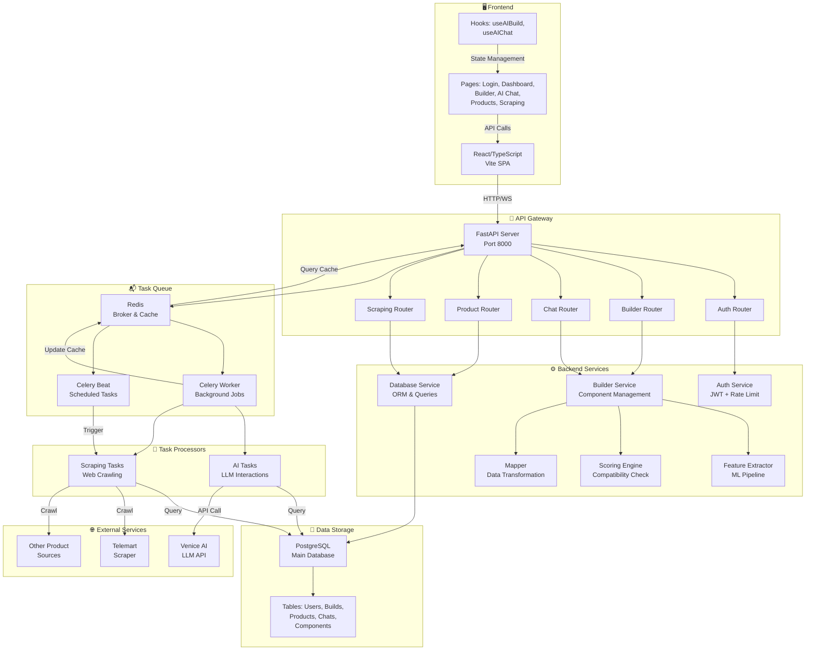

# System Architecture Diagram

```mermaid
graph TB
    subgraph Client["🖥️ Frontend"]
        Browser["React/TypeScript<br/>Vite SPA"]
        Pages["Pages: Login, Dashboard,<br/>Builder, AI Chat,<br/>Products, Scraping"]
        Hooks["Hooks: useAIBuild,<br/>useAIChat"]
    end

    subgraph API["🔗 API Gateway"]
        FastAPI["FastAPI Server<br/>Port 8000"]
        AuthRouter["Auth Router"]
        BuilderRouter["Builder Router"]
        ChatRouter["Chat Router"]
        ProductRouter["Product Router"]
        ScrapingRouter["Scraping Router"]
    end

    subgraph Services["⚙️ Backend Services"]
        AuthService["Auth Service<br/>JWT + Rate Limit"]
        BuilderService["Builder Service<br/>Component Management"]
        DatabaseService["Database Service<br/>ORM & Queries"]
        FeatureExtractor["Feature Extractor<br/>ML Pipeline"]
        ScoringEngine["Scoring Engine<br/>Compatibility Check"]
        Mapper["Mapper<br/>Data Transformation"]
    end

    subgraph Queue["📬 Task Queue"]
        Redis["Redis<br/>Broker & Cache"]
        CeleryWorker["Celery Worker<br/>Background Jobs"]
        CeleryBeat["Celery Beat<br/>Scheduled Tasks"]
    end

    subgraph Tasks["🔧 Task Processors"]
        AITasks["AI Tasks<br/>LLM Interactions"]
        ScrapingTasks["Scraping Tasks<br/>Web Crawling"]
    end

    subgraph Storage["💾 Data Storage"]
        PostgreSQL["PostgreSQL<br/>Main Database"]
        Tables["Tables: Users, Builds,<br/>Products, Chats,<br/>Components"]
    end

    subgraph External["🌐 External Services"]
        VeniceAI["Venice AI<br/>LLM API"]
        Telemart["Telemart<br/>Scraper"]
        OtherSources["Other Product<br/>Sources"]
    end

    Browser -->|HTTP/WS| FastAPI
    Pages -->|API Calls| Browser
    Hooks -->|State Management| Pages

    FastAPI --> AuthRouter
    FastAPI --> BuilderRouter
    FastAPI --> ChatRouter
    FastAPI --> ProductRouter
    FastAPI --> ScrapingRouter

    AuthRouter --> AuthService
    BuilderRouter --> BuilderService
    ChatRouter --> BuilderService
    ProductRouter --> DatabaseService
    ScrapingRouter --> DatabaseService

    BuilderService --> FeatureExtractor
    BuilderService --> ScoringEngine
    BuilderService --> Mapper

    DatabaseService --> PostgreSQL
    PostgreSQL --> Tables

    FastAPI --> Redis
    Redis --> CeleryWorker
    Redis --> CeleryBeat

    CeleryWorker --> AITasks
    CeleryWorker --> ScrapingTasks
    CeleryBeat -->|Trigger| ScrapingTasks

    AITasks -->|Query| PostgreSQL
    ScrapingTasks -->|Query| PostgreSQL

    AITasks -->|API Call| VeniceAI
    ScrapingTasks -->|Crawl| Telemart
    ScrapingTasks -->|Crawl| OtherSources

    CeleryWorker -->|Update Cache| Redis
    Redis -->|Query Cache| FastAPI
```
