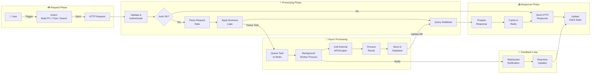

# Data Flow Diagram

```mermaid
graph LR
    subgraph Request["📥 Request Phase"]
        User["👤 User"]
        Action["Action:<br/>Build PC / Chat / Search"]
        HTTPReq["HTTP Request"]
    end

    subgraph Processing["⚡ Processing Phase"]
        Validate["Validate &<br/>Authenticate"]
        AuthCheck{Auth OK?}
        ParseData["Parse Request<br/>Data"]
        ApplyLogic["Apply Business<br/>Logic"]
        Query["Query Database"]
    end

    subgraph Async["🔄 Async Processing"]
        QueueTask["Queue Task<br/>to Redis"]
        AsyncWork["Background<br/>Worker Process"]
        ExternalAPI["Call External<br/>API/Scraper"]
        ProcessResult["Process<br/>Result"]
        StoreResult["Store in<br/>Database"]
    end

    subgraph Response["📤 Response Phase"]
        PrepareResp["Prepare<br/>Response"]
        Cache["Cache in<br/>Redis"]
        SendResp["Send HTTP<br/>Response"]
        ClientUpdate["Update<br/>Client State"]
    end

    subgraph Feedback["🔁 Feedback Loop"]
        WSNotify["WebSocket<br/>Notification"]
        RealTime["Real-time<br/>Updates"]
    end

    User -->|Trigger| Action
    Action -->|Send| HTTPReq
    HTTPReq --> Validate
    Validate --> AuthCheck
    AuthCheck -->|Yes| ParseData
    AuthCheck -->|No| SendResp
    ParseData --> ApplyLogic
    ApplyLogic --> Query
    Query --> PrepareResp

    ApplyLogic -->|Heavy Task| QueueTask
    QueueTask --> AsyncWork
    AsyncWork --> ExternalAPI
    ExternalAPI --> ProcessResult
    ProcessResult --> StoreResult
    StoreResult -->|Update DB| Query

    PrepareResp --> Cache
    Cache --> SendResp
    SendResp --> ClientUpdate

    AsyncWork -->|Notify| WSNotify
    WSNotify --> RealTime
    RealTime --> ClientUpdate
```
