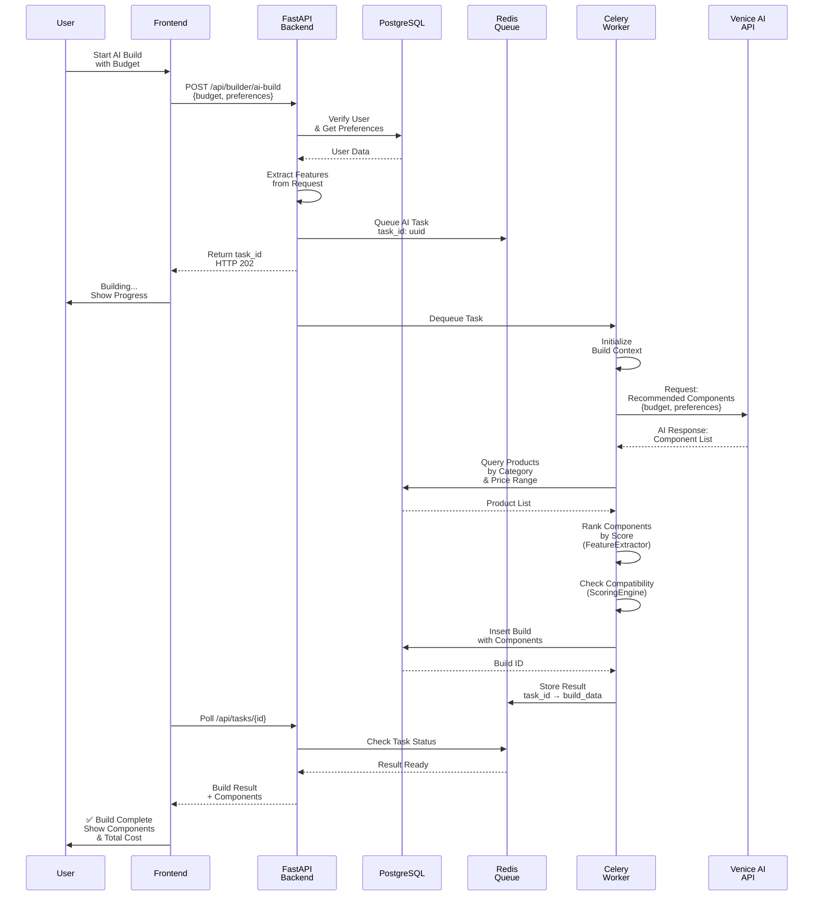

# Sequence Diagram: AI-Assisted PC Build Flow

```mermaid
sequenceDiagram
    participant User
    participant Frontend
    participant Backend as FastAPI<br/>Backend
    participant DB as PostgreSQL
    participant Redis as Redis<br/>Queue
    participant Worker as Celery<br/>Worker
    participant AI as Venice AI<br/>API

    User->>Frontend: Start AI Build<br/>with Budget
    Frontend->>Backend: POST /api/builder/ai-build<br/>{budget, preferences}

    Backend->>DB: Verify User<br/>& Get Preferences
    DB-->>Backend: User Data

    Backend->>Backend: Extract Features<br/>from Request

    Backend->>Redis: Queue AI Task<br/>task_id: uuid
    Backend-->>Frontend: Return task_id<br/>HTTP 202
    Frontend->>User: Building...<br/>Show Progress

    Backend->>Worker: Dequeue Task
    Worker->>Worker: Initialize<br/>Build Context

    Worker->>AI: Request:<br/>Recommended Components<br/>{budget, preferences}
    AI-->>Worker: AI Response:<br/>Component List

    Worker->>DB: Query Products<br/>by Category<br/>& Price Range
    DB-->>Worker: Product List

    Worker->>Worker: Rank Components<br/>by Score<br/>(FeatureExtractor)

    Worker->>Worker: Check Compatibility<br/>(ScoringEngine)

    Worker->>DB: Insert Build<br/>with Components
    DB-->>Worker: Build ID

    Worker->>Redis: Store Result<br/>task_id → build_data

    Frontend->>Backend: Poll /api/tasks/{id}
    Backend->>Redis: Check Task Status
    Redis-->>Backend: Result Ready
    Backend-->>Frontend: Build Result<br/>+ Components

    Frontend->>User: ✅ Build Complete<br/>Show Components<br/>& Total Cost
```
