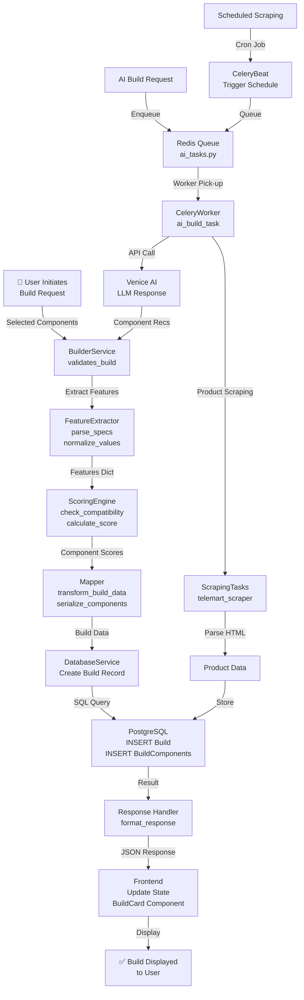

# Component Interaction: Builder Workflow

```mermaid
graph TD
    A["👤 User Initiates<br/>Build Request"] -->|Selected Components| B["BuilderService<br/>validates_build"]

    B -->|Extract Features| C["FeatureExtractor<br/>parse_specs<br/>normalize_values"]
    C -->|Features Dict| D["ScoringEngine<br/>check_compatibility<br/>calculate_score"]

    D -->|Component Scores| E["Mapper<br/>transform_build_data<br/>serialize_components"]

    E -->|Build Data| F["DatabaseService<br/>Create Build Record"]
    F -->|SQL Query| G["PostgreSQL<br/>INSERT Build<br/>INSERT BuildComponents"]

    G -->|Result| H["Response Handler<br/>format_response"]

    H -->|JSON Response| I["Frontend<br/>Update State<br/>BuildCard Component"]

    I -->|Display| J["✅ Build Displayed<br/>to User"]

    K["AI Build Request"] -->|Enqueue| L["Redis Queue<br/>ai_tasks.py"]
    L -->|Worker Pick-up| M["CeleryWorker<br/>ai_build_task"]
    M -->|API Call| N["Venice AI<br/>LLM Response"]
    N -->|Component Recs| B

    O["Scheduled Scraping"] -->|Cron Job| P["CeleryBeat<br/>Trigger Schedule"]
    P -->|Queue| L
    M -->|Product Scraping| Q["ScrapingTasks<br/>telemart_scraper"]
    Q -->|Parse HTML| R["Product Data"]
    R -->|Store| G
```
