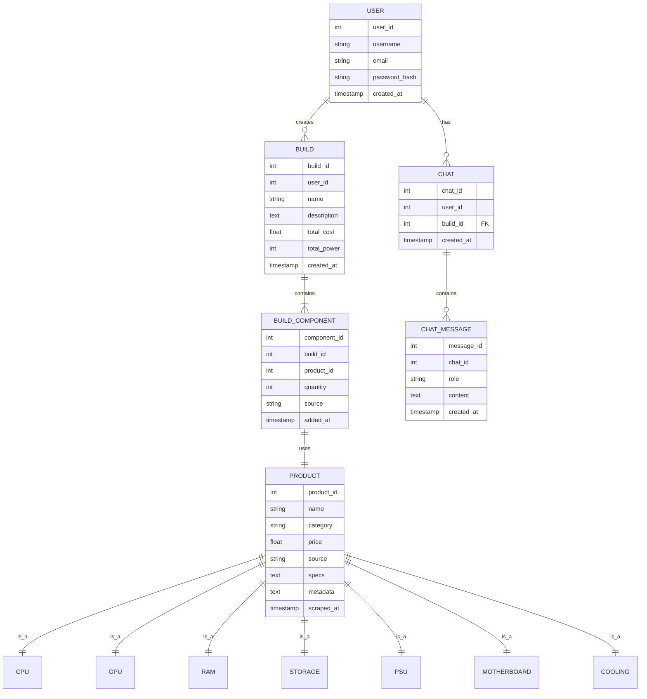

# Database Schema Overview

```mermaid
erDiagram
    USER ||--o{ BUILD : creates
    USER ||--o{ CHAT : has
    USER {
        int user_id
        string username
        string email
        string password_hash
        timestamp created_at
    }

    BUILD ||--|{ BUILD_COMPONENT : contains
    BUILD {
        int build_id
        int user_id
        string name
        text description
        float total_cost
        int total_power
        timestamp created_at
    }

    BUILD_COMPONENT ||--|| PRODUCT : uses
    BUILD_COMPONENT {
        int component_id
        int build_id
        int product_id
        int quantity
        string source
        timestamp added_at
    }

    PRODUCT ||--|| CPU : is_a
    PRODUCT ||--|| GPU : is_a
    PRODUCT ||--|| RAM : is_a
    PRODUCT ||--|| STORAGE : is_a
    PRODUCT ||--|| PSU : is_a
    PRODUCT ||--|| MOTHERBOARD : is_a
    PRODUCT ||--|| COOLING : is_a

    PRODUCT {
        int product_id
        string name
        string category
        float price
        string source
        text specs
        text metadata
        timestamp scraped_at
    }

    CHAT ||--o{ CHAT_MESSAGE : contains
    CHAT {
        int chat_id
        int user_id
        int build_id FK
        timestamp created_at
    }

    CHAT_MESSAGE {
        int message_id
        int chat_id
        string role
        text content
        timestamp created_at
    }
```
