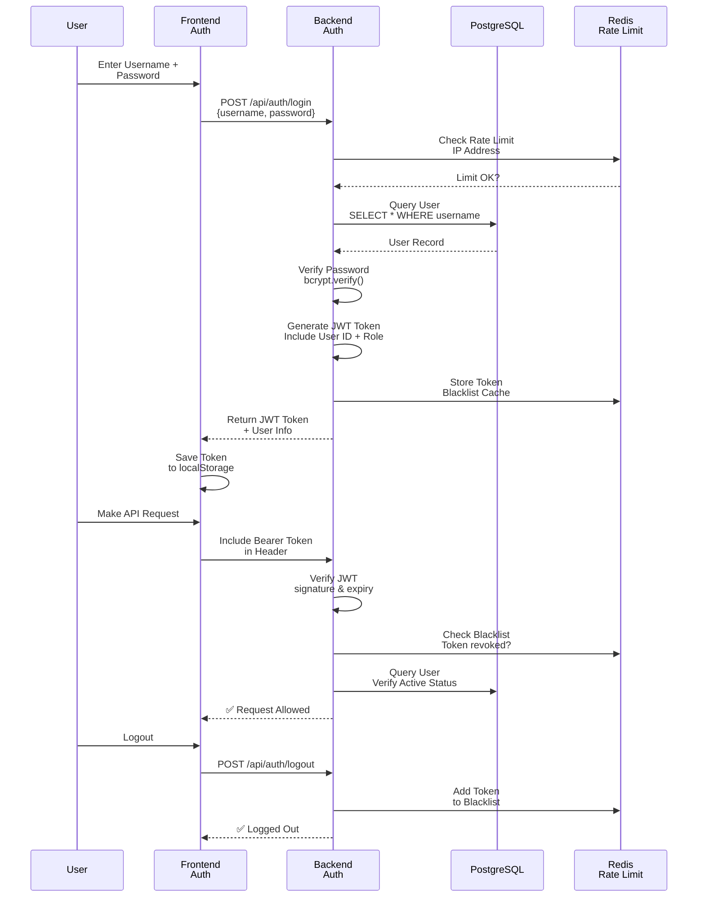

# Authentication & Security Flow

```mermaid
sequenceDiagram
    participant User
    participant Frontend as Frontend<br/>Auth
    participant Backend as Backend<br/>Auth
    participant DB as PostgreSQL
    participant Redis as Redis<br/>Rate Limit

    User->>Frontend: Enter Username +<br/>Password
    Frontend->>Backend: POST /api/auth/login<br/>{username, password}

    Backend->>Redis: Check Rate Limit<br/>IP Address
    Redis-->>Backend: Limit OK?

    Backend->>DB: Query User<br/>SELECT * WHERE username
    DB-->>Backend: User Record

    Backend->>Backend: Verify Password<br/>bcrypt.verify()

    Backend->>Backend: Generate JWT Token<br/>Include User ID + Role

    Backend->>Redis: Store Token<br/>Blacklist Cache

    Backend-->>Frontend: Return JWT Token<br/>+ User Info

    Frontend->>Frontend: Save Token<br/>to localStorage

    User->>Frontend: Make API Request
    Frontend->>Backend: Include Bearer Token<br/>in Header

    Backend->>Backend: Verify JWT<br/>signature & expiry

    Backend->>Redis: Check Blacklist<br/>Token revoked?

    Backend->>DB: Query User<br/>Verify Active Status

    Backend-->>Frontend: ✅ Request Allowed

    User->>Frontend: Logout
    Frontend->>Backend: POST /api/auth/logout
    Backend->>Redis: Add Token<br/>to Blacklist
    Backend-->>Frontend: ✅ Logged Out
```
